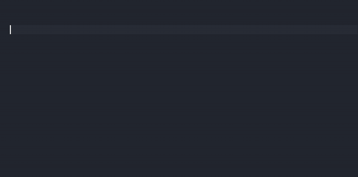

## Setup

In addtion to this one, we strongly recommend you to install the great [Laravel Blade Snippets](https://marketplace.visualstudio.com/items?itemName=onecentlin.laravel-blade) extension by Winnie Lin. Follow the instructions there if you have any trouble with auto completion or syntax highlighting in Blade files.

> Suggest Laravel related extension: [Laravel Blade Snippets](https://marketplace.visualstudio.com/items?itemName=onecentlin.laravel-blade)

## How to use

Start typing the snippet prefix, select the desired snippet and press TAB or ENTER to confirm your selection. Most of the time you don't even have to type the `b:` at the beginning. It really depends on the suggestions or overlaps you get from other extensions.

**Remember:** in Visual Studio Code you can use TAB to advance to the next tab stop of the snippet body or quickly advance to the end of it and continue coding.

## Snippets

Here's a list of all current snippet prefixes and their resulting bodies.

| Snippet           |   | Result                                                                    |
|-------------------|---|---------------------------------------------------------------------------|
| `b:langhelp`      | → | `{{ __('') }}`                                                            | 
| `b:route`         | → | `{{ route('') }}`                                                         |
| `b:href`          | → | `href="{{ route('') }}"`                                                  |
| `b:alt`           | → | `alt="{{ __('') }}"`                                                      |
| `b:src`           | → | `src="{{ asset('') }}"`                                                   |
| `b:img`           | → | ``                          |
| `b:anchor`        | → | `<a href="{{ route('') }}" alt="{{ __('') }}">{{ __('') }}</a>`           |
| `b:anchor-class`  | → | `<a class="" href="{{ route('') }}" alt="{{ __('') }}">{{ __('') }}</a>`  |

## Credits

[arbiträr](https://arbitraer.de) – Digital agency for web development in Flensburg, Germany